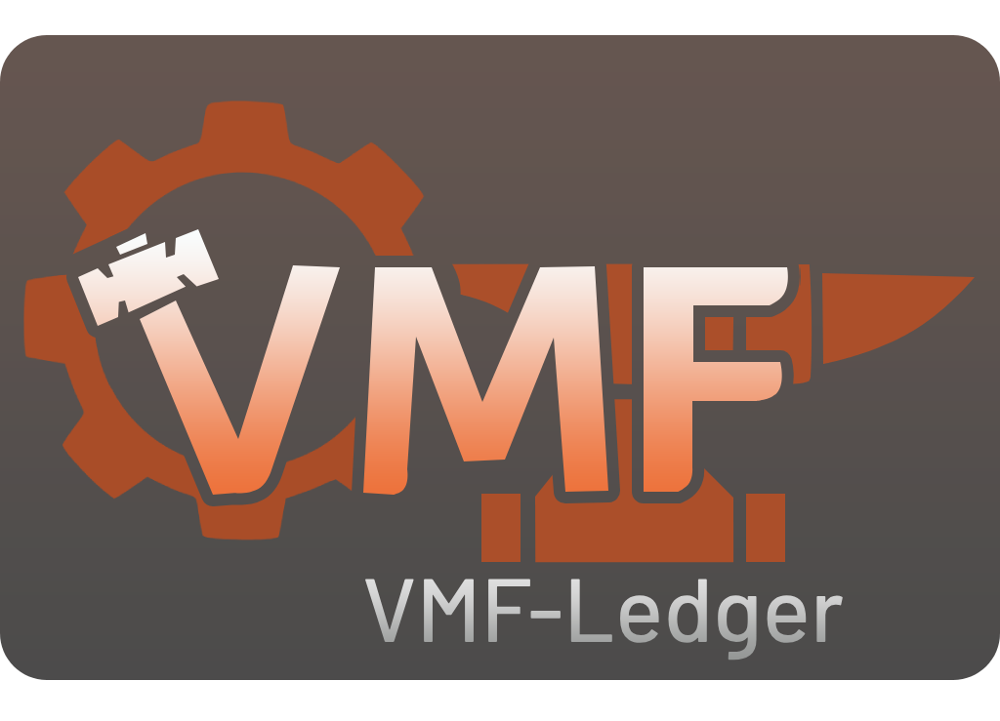

<div align="center">


[](https://crates.io/crates/vmf-ledger)
[](https://docs.rs/vmf-ledger)
[](LICENSE)
[](https://developer.valvesoftware.com/wiki/Source)

A Rust library for **reversible VMF edits**: structural diff, entity block matching, and sidecar `.vdif` journals for Source Engine tooling.
</div>

---

Modify a `.vmf` freely with your compiler or tool, compute the exact delta, and store rollback operations in a sidecar `.vdif` journal next to the map. When rolling back, only the entities modified or created by your tool are touched - manual mapper edits (retextured brushes, new geometry, moved objects) and changes made by other independent tools stay intact.

## Installation

Add this to your `Cargo.toml`:

```toml
[dependencies]
vmf-ledger = "1.0"
source-vmf = "0.5"
```

## Features

- **Multi-tool Isolation**: Multiple compilers can touch the same map without knowing about each other. Each tool owns its section in the shared `.vdif` sidecar and a unique marker in the map. Rolling one tool back leaves the rest untouched.
- **Hammer-safe**: Hammer strips unknown VMF blocks on save. `vmf-ledger` keeps operational journals in an external `.vdif` file (JSON) and writes only minimal, safe markers (`world` keyvalues and entity keys like `_vl_<tool>`) into the map itself.
- **Collision Detection**: Refuses to roll back if a mapper subsequently modified the exact properties your tool touched, unless explicit `force: true` is provided.
- **Automatic Visgroups**: Automatically groups all generated entities into a dedicated Hammer visgroup so mappers can toggle tool-generated geometry with one click.

## Usage

### 1. Tracking & Committing Edits

Wrap a `VmfFile` in `TrackedVmf`, mutate it directly via `DerefMut`, and call `finish()` to compute the diff and write markers:

```rust
use std::error::Error;
use source_vmf::prelude::*;
use vmf_ledger::{LedgerOptions, TrackedVmf, sidecar::Sidecar};

fn main() -> Result<(), Box<dyn Error>> {
    let opts = LedgerOptions::new("my-tool", "1.0")
        .with_visgroup("Generated Props"); // Optional: groups created entities in Hammer

    let mut map = TrackedVmf::new(VmfFile::open("maps/test.vmf")?);

    // Modify entities freely
    for ent in map.entities.iter_mut() {
        if ent.classname == "info_target" {
            ent.set("classname".into(), "info_teleport_destination".into());
        }
    }

    // Compute diff, stamp markers, and generate sidecar journal
    let (map, journal) = map.finish(&opts)?;

    map.save("maps/test.vmf")?;
    journal.write(Sidecar::path_for("maps/test.vmf"))?;

    Ok(())
}
```

### 2. Rolling Back Edits

Read the tool's section from the `.vdif` sidecar and restore the `.vmf` in place:

```rust
use std::error::Error;
use source_vmf::prelude::*;
use vmf_ledger::{LedgerOptions, RestoreOptions, restore, sidecar::{Journal, Sidecar}};

fn main() -> Result<(), Box<dyn Error>> {
    let opts = LedgerOptions::new("my-tool", "1.0");
    let mut map = VmfFile::open("maps/test.vmf")?;

    let sidecar_path = Sidecar::path_for("maps/test.vmf");
    if let Some(journal) = Journal::read(&sidecar_path, &opts.name)? {
        // Reverts only changes made by "my-tool"
        restore(&mut map, &journal, &opts, &RestoreOptions::default())?;
        map.save("maps/test.vmf")?;
    }

    Ok(())
}
```

If a mapper has edited properties touched by the tool in Hammer, `restore()` returns `LedgerError::Collisions`. Pass `RestoreOptions { force: true }` if you explicitly want to overwrite mapper modifications.

## License

Distributed under the [MIT License](LICENSE).
